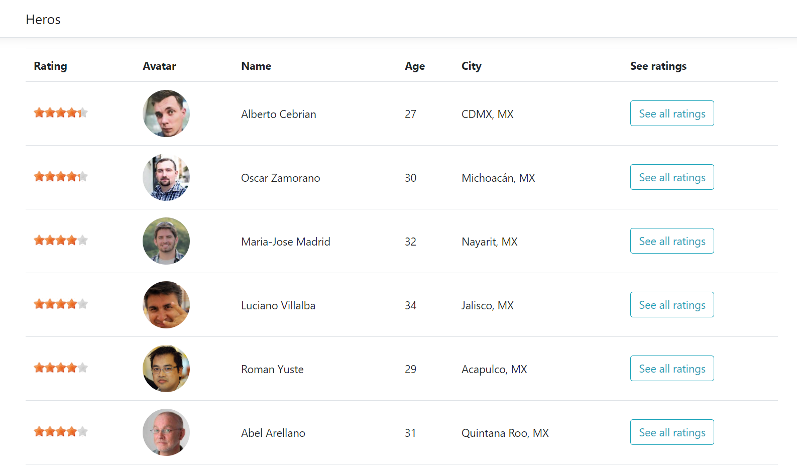

# Heros App

Heros app is a sample project to implement a website with ASP.NET Core MVC. Other technologies that I used in the project such as:

- Postgres SQL
- Entity framework Core
- Razor

I decided to use Postgres SQL to create my database because I have not had the opportunity to work with this tool a lot. In another hand, I used a third party library JS called RateIt to show the star rating of the heros. I defined the default data on migrations files because it's better.

# Features

The first screen that you will see is the 'index'.


After that you click on the button then you go to the next page where you are going to see the Heros list.



You will look at the list with some data about them such as their photo, rating, personal information and the historical ratings.


### Installation

Install the dependencies and Docker app.

```sh
$ dotnet restore
```

In this point, it is necessary to review the connectionstring on the appsettings file and do the respect changes.

```sh
$ { "DefaultConnection": "Server=127.0.0.1; Port=5432; User Id=postgres; Password=12345; Database=HerosDB; Pooling=true" }
```

Then you need to run the migration on the NuGet Console to create your database on Postgres SQL.

```sh
$ update-database
```

Finally, you need to run the project with Docker run.

### Docker

HerosApp is very easy to install and deploy in a Docker container.

By default, the Docker will expose port 80, so change this within the Dockerfile if necessary. When ready, simply use the Dockerfile to build the image.

## License

MIT
